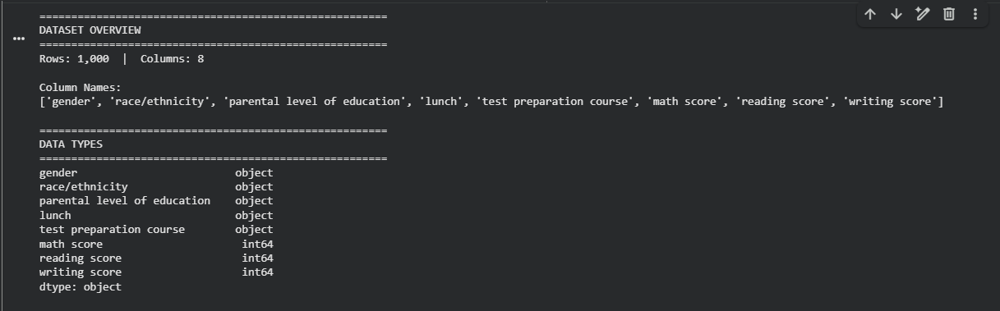
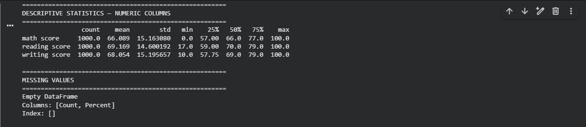
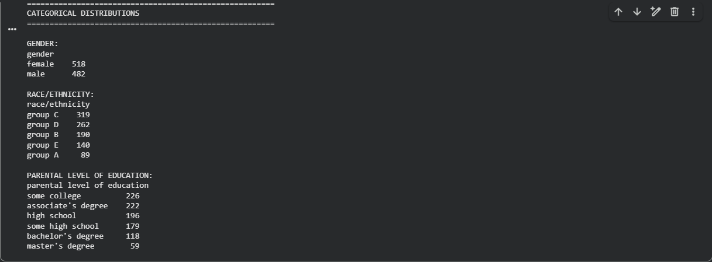
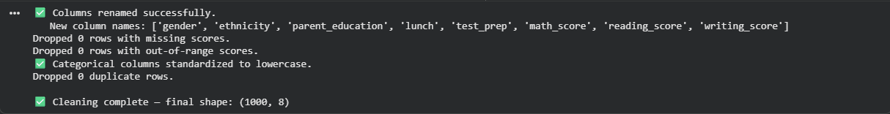
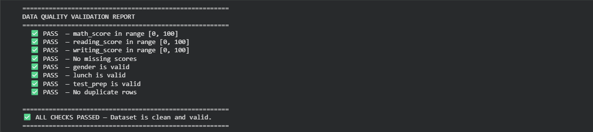
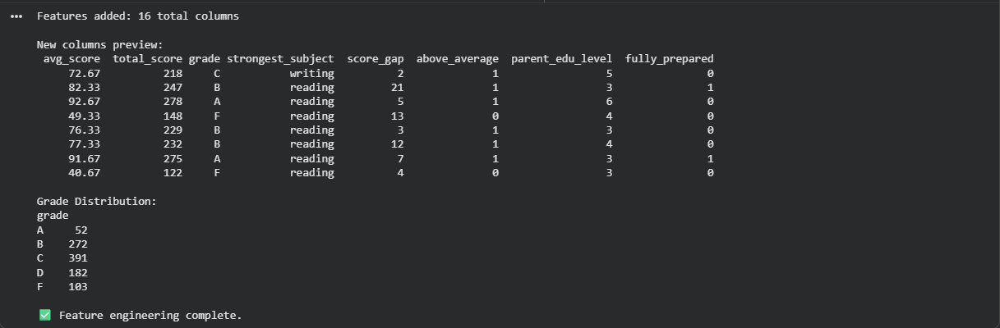
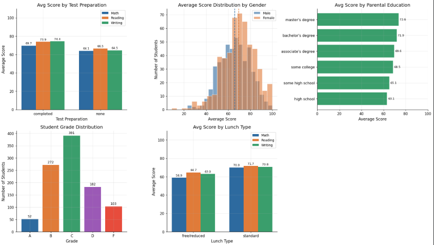

# 🎓 Student Performance Analysis Pipeline

An end-to-end data analysis project exploring the key factors that influence student academic performance across Math, Reading, and Writing — built with Python and Jupyter Notebook.

---

## 📌 Project Overview

This project walks through a complete data analysis pipeline applied to real-world student exam data. The goal is to uncover what factors — such as test preparation, parental education, lunch type, and gender — have the strongest impact on student scores.

**Pipeline Stages:**
> EDA → Data Cleaning → Validation → Feature Engineering → Visualization

---

## 📊 Dataset

- **Source:** [Students Performance in Exams — Kaggle](https://www.kaggle.com/datasets/spscientist/students-performance-in-exams)
- **Size:** 1,000 student records
- **Features:** Gender, Ethnicity, Parental Education, Lunch Type, Test Preparation, Math / Reading / Writing Scores

---

## 🔍 Exploratory Data Analysis (EDA)

Before any processing, we explored the full dataset structure, data types, descriptive statistics, and categorical distributions.

**Dataset Overview & Data Types**



**Descriptive Statistics**



**Missing Values & Categorical Distributions**



---

## 🧹 Data Cleaning

Renamed columns for clarity, enforced valid score ranges (0–100), standardized categorical text, filled missing values, and removed duplicates.



---

## ✅ Data Quality Validation

Each business rule was verified independently. Only failing records are printed — making issues immediately actionable.



---

## ⚙️ Feature Engineering

Created 8 new meaningful features on top of the raw data:

| Feature | Description |
|---|---|
| `avg_score` | Mean score across all 3 subjects |
| `total_score` | Sum of all 3 subject scores |
| `grade` | Letter grade (A–F) based on average score |
| `strongest_subject` | Subject with the highest score per student |
| `score_gap` | Difference between max and min subject score |
| `above_average` | 1 if student is above the global average |
| `parent_edu_level` | Ordinal encoding of parental education |
| `fully_prepared` | 1 if completed test prep AND has standard lunch |



---

## 📈 Business Insights Dashboard

Five key findings visualized in a single professional dashboard:

1. **Test Preparation** — Students who completed the course consistently scored higher across all subjects
2. **Gender Distribution** — Score distributions differ between male and female students
3. **Parental Education** — Higher parental education correlates with better student performance
4. **Grade Distribution** — Most students fall in the B/C range
5. **Lunch Type** — Standard lunch students outperform free/reduced lunch peers significantly



---

## 🛠️ Tech Stack


---

## 🚀 How to Run

1. Clone the repository
```bash
git clone https://github.com/YOUR_USERNAME/students-performance-analysis.git
cd students-performance-analysis
```

2. Install dependencies
```bash
pip install pandas numpy matplotlib jupyter
```

3. Download the dataset and place `StudentsPerformance.csv` in the root folder

4. Launch the notebook
```bash
jupyter notebook student_performance_analysis.ipynb
```

5. Run all cells in order ✅

---

## 📁 Project Structure

```
students-performance-analysis/
│
├── student_performance_analysis.ipynb   ← Main notebook
├── StudentsPerformance.csv              ← Raw dataset (download from Kaggle)
├── cleaned_students.csv                 ← Auto-generated after Cell 2
├── featured_students.csv                ← Auto-generated after Cell 4
├── dashboard.png                        ← Auto-generated after Cell 5
│
└── images/
    ├── 01_eda_overview.png
    ├── 02_eda_statistics.png
    ├── 03_eda_distributions.png
    ├── 04_cleaning_output.png
    ├── 05_validation_checks.png
    ├── 06_feature_engineering.png
    └── 07_dashboard.png
```

---

## 💡 Key Findings

- ✅ Students who **completed test preparation** scored on average **+5 to +8 points** higher across all subjects
- ✅ **Parental education level** is the strongest demographic predictor of student performance
- ✅ Students with **standard lunch** consistently outperform those on free/reduced lunch — likely a socioeconomic indicator
- ✅ **Reading and Writing scores** are highly correlated, while Math shows more independent variation
- ✅ Only ~25% of students achieve a grade of **A**, with the majority landing in B or C
